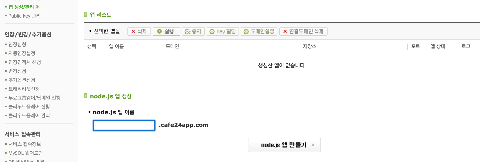
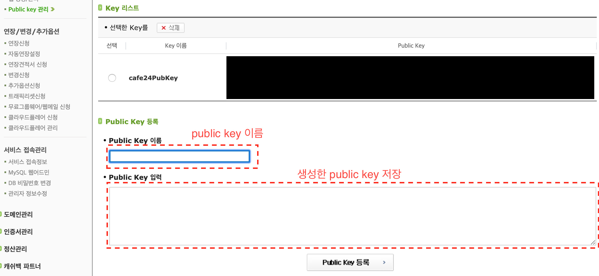
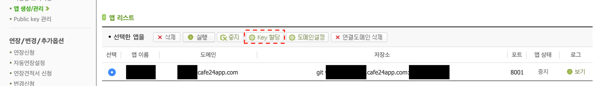
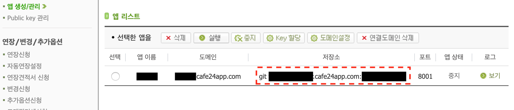

# cafe 24 node hosting

node.js 호스팅은 일반적인 웹호스팅과는 달리 FTP 를 통한 파일 업로드를 지원하지 않습니다. 로컬 PC에서 작업한 결과물을 서버에 업로드 하려면 git를 이용하여 파일을 업로드 해야 합니다.

## cafe24 node hosting 설정하기

### 1. node.js 앱 생성



### 2. [ssh public key 생성](https://help.cafe24.com/cs/cs_manual_view.php?idx=46&page=1&categoryIdx=509&s_key=&s_value=&man_no=1) -> 옆의 url에서 "4. ssh public key 생성"을 따라서 public key를 생성합니다. 

```
# 간략한 설명 추가 

# 1. terminal 열기

# 2. 아래의 명령을 terminal에 작성 (-C 옵션에는 github에서 사용하는 email을 써주세요)
$ ssh-keygen -t rsa -b 4096 -C "your_email@example.com"

# 3. ssh key를 저장할 위치를 입력
Enter a file in which to save the key (/Users/you/.ssh/id_rsa): [Press enter]

# 4. passphrase를 입력하는 입니다.(passphrase를 등록해서 사용하면 git에 code를 올릴때마다 비번을 등록하야합니다. 필요하지 않으면 enter를 입력합니다.)

> Enter passphrase (empty for no passphrase): [Type a passphrase]
> Enter same passphrase again: [Type passphrase again]
```

key 생성 위치에 들어가면(/Users/you/.ssh/id_rsa)id_rsa와 id_rsa.pub 파일이 생성될 것입니다. id_rsa는 private key이고 id_rsa.pub는 public key 입니다.

### 3. public key를 cafe24에 등록하기



public key 이름은 알아볼 수 있는 이름으로 입력하시면 됩니다.
2번에서 생성한 id_rsa.pub의 내용을 public key 입력란에 복사해서 넣습니다.

### 4. public key 할당하기



3번에서 public key 이름으로 지정하신 key를 할당합니다.

### 5. cafe24 git 설정 - git 설정은 node server code가 있는 folder에서 실행해야 합니다. 



위의 사진에서 저장소의 주소가 node code를 upload할 git 저장소 주소입니다.
위의 git 주소에 작성한 node server code를 upload할 것 입니다.

upload하는 방법

```bash
# 1. git remote 저장소 등록
git remote add origin <5번에서 저장소의 주소>

# 이미 origin이라는 이름으로 저장소가 등록되어 있는 경우 아래의 명령어 실행 후 위의 1번 다시 실행
# git remote remove origin

# 변경된 사항을 추가
git add .

# 변경된 file local에 저장
git commit -m "<변경사항에 대한 message>"

# origin remote 저장소 master branch에 upload
git push origin master
```

## 주의사항

- node_module을 모두 추가하여 저장해야 upload해야 합니다.

- node 시작 파일의 이름이 web.js 으로 설정해야 합니다.
